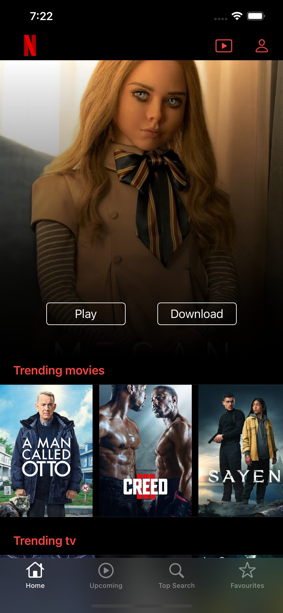

# Netflix Clone

- Used Swift 5 and UIKit.
- Used tmdb API (https://api.themoviedb.org) to fetch all movie and tv shows.
- Used YouTube API to show movie trailer. 
- Used Core Data to save data. 

## Home Tab

- There is a bunch of lists of trending movies, trending tv, popular, upcoming and top rated movies.

- Hero Header

- All movie and tv shows

- Hero Header Animation

[label](Screenshots/mainTabv1.mp4)

- Home Tab Scroll

[label](Screenshots/mainTabv2.mp4)

## Upcoming Tab

- Shows list of upcoming movie and tv shows

- Upcoming Tab Scroll

[label](Screenshots/upcomingTabvd.mp4)

## Top Search Tab

- Shows list of top searched movie and tv shows

- Searching movie or tv shows

- Top Search Tab Scroll

[label](Screenshots/TopSearchvd.mp4)

- Searching....

[label](Screenshots/TopSearch2vd.mp4)

## Add to Favourites

- We can add a movie or tv show to the favourites

- Simply long press a movie/ tv show and click "Add to Favourites"

[label](Screenshots/addToFabvd.mp4)

## Favourites Tab

- All the movies and tv shows that we add as a favourite is shown in this tab

- Adding a movie as a favourite....

[label](Screenshots/fabvd.mp4)

## Watch Youtube Trailer

- We can watch trailer of a movie with the help of Youtube API

- Watching a trailer....

[label](Screenshots/previewvd.mp4)